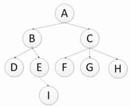

# Scrapy

## 正则表达式

| 字符              |                    作用                    |
| --------------- | :--------------------------------------: |
| ^               |                 匹配字符串的开头                 |
| $               |                匹配字符串的末尾。                 |
| .               | 匹配任意字符，除了换行符，当re.DOTALL标记被指定时，则可以匹配包括换行符的任意字符。 |
| [...]           |    用来表示一组字符,单独列出：[amk] 匹配 'a'，'m'或'k'    |
| [^...]          |     不在[]中的字符: \[^abc]匹配除了a,b,c之外的字符。     |
| re*             |               匹配0个或多个的表达式。               |
| re+             |            匹配1个或多个的表达式（至少一个）。            |
| re?             |    匹配0个或1个由前面的正则表达式定义的片段，非贪婪方式（从左往右）     |
| re{ n}          |               精确匹配n个前面的表达式               |
| re{ n, m}       |              匹配大于等于n个前面表达式               |
| re{ n, m}       |  匹配 n 到 m 次由前面的正则表达式定义的片段，贪婪方式（从右往左匹配）   |
| a\| b           |                  匹配a或b                   |
| \s              |        匹配任意空白字符 ，等价于 [\t\n\r\f].         |
| \S              |                 匹配任意非空字符                 |
| \w              |                  匹配字母数字                  |
| \W              |                 匹配非字母数字                  |
| [\u4E00-\u9FA5] |                  匹配任意汉字                  |
| \d              |            匹配任意数字，等价于 [0-9].             |
| \D              |                 匹配任意非数字                  |

## 网站树结构



* 深度优先算法

深度优先算法的遍历顺序是A-B-D-E-I-C-F-G-H(递归实现)

* 广度优先算法

广度优先算法的遍历顺序是A-B-C-D-E-F-G-H-I(队列实现)

## 爬虫去重策略

1. 将访问过的url保存如数据库
2. 将访问过的url存入set中，只需要o(1)的代价就可以查询url。100000000\*2byte\*50个字符/1024/1024/1024=9G
3. url经过md5等方法哈希后保存入set中
4. 用bitmap方法，将访问过的url通过hash函数映射到某一位
5. bloomfilter方法对bitmap进行改进，多重hash函数降低冲突

## 字符串编码

1. 计算机只能处理数字，文本转换为数字才能处理。计算机中8个bit作为一个字节，所以一个字节能表示的最大数字是255。
2. 计算机是美国人发明的，一个字节就能表示所有字符了，所以ASCII(一个字节)编码就成为美国人的标准编码。
3. 但ASCII处理中文明显是不够的，中文不止255个汉字，所以制定了GB2312，用两个字节表示一个汉字。但不同国家发展的编码不同，标准不统一。
4. Unicode将所有的语言统一到一套编码中。但中英文都用Unicode浪费空间，所以出现了可变长的的编码"UTF-8",把英文变成一个字节，汉字变成3个字节，生僻字变成4-6个字节。


## 初始化工程

```
scrapy startproject articalScrapy
```

初始化的工程中，spiders文件夹用于存放爬虫文件，items.py用于定义数据保存的格式，middlewares用于保存中间件，pipeline.py用于数据存储操作，setting.py用于系统设置。

*创建爬虫模版*

```
scrapy genspider example example.com
```

运行单个爬虫

```
scrapy crawl jobbole
```

## xpath简介

1. xpath使用路径表达式在xml和html中进行导航
2. xpath包含标准函数库
3. xpath是一个w3c的标准

### xpath节点关系

1. 父节点，相邻上一层级的节点
2. 子节点，相邻下一层级节点
3. 同胞节点，同一层级的节点
4. 先辈节点，该节点所在层级之上的节点
5. 后代节点，该节点所在层级之下的节点

### xpath语法

| 表达式                     | 说明                                       |
| ----------------------- | ---------------------------------------- |
| article                 | 选取所有article元素                            |
| /article                | 选取根元素article                             |
| Article/a               | 选取所有属于article的子元素的a元素                    |
| //div                   | 选取所有div子元素                               |
| Article//div            | 选取所有属于article元素的后代的div元素，不管它出现在article之下的任何位置 |
| //@class                | 选取所有名为class的属性                           |
| /article/div[1]         | 选取属于article子元素的第一个div元素                  |
| /article/div[last()]    | 选取属于article子元素的最后一个div元素                 |
| /article/div[last()-1]  | 选取属于article子元素的倒数第二个div元素                |
| //div[@lang]            | 选取所有拥有lang属性的div元素                       |
| //div[@lang='eng']      | 选取所有lang属性为eng的div元素                     |
| /div/*                  | 选取属于div元素的所有子节点                          |
| //*                     | 选取所有元素                                   |
| //div[@*]               | 选取所有带属性的div元素                            |
| /div/a \| //div/p       | 选取所有div元素的a和p元素                          |
| //span \| //ul          | 选取文档中的span元素与ul元素                        |
| article/div/p \| //span | 选取所有属于article元素的div元素的p元素以及文档中的所有的span元素 |

